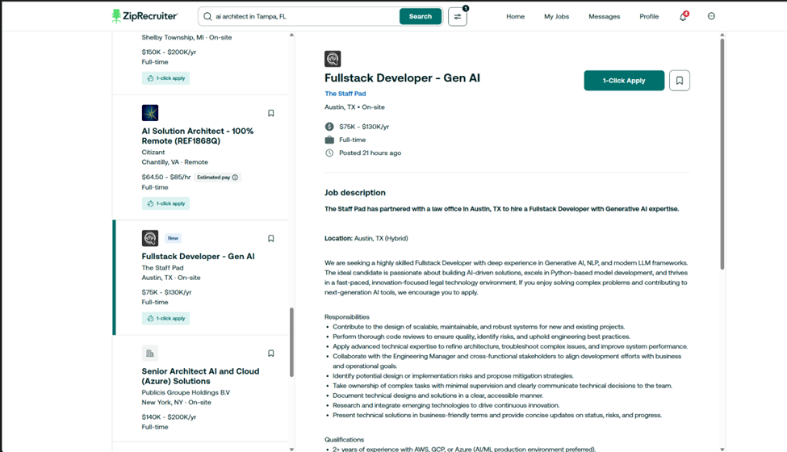
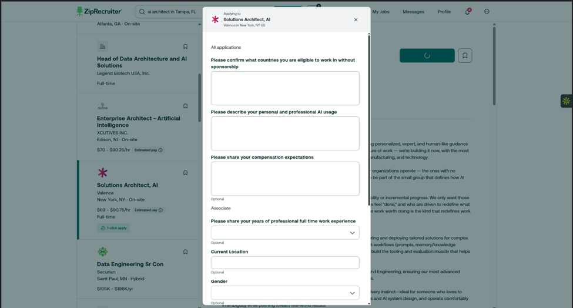
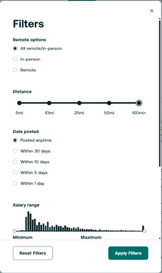

Example of how ZipRecruiter jobs to be identified to shortlist and apply

Lets say this is one job posting while searching one by one listing, the listings are at left.
We need to find jobs which only has this 1-click apply option, upon finding these types of jobs, we shall see if the job title matches our resume profile, even if matches vaguely, then we move on to next step. We keep up the scale to 0-1 to match the title, depending on this configuration we need to proceed whether to analyze the job description now, now we have to analyze the job description with our resume, if it matches then we shall proceed to apply using that 1-click apply button. We can even configure the match score to how much % it matches, we should proceed applying. Upon pressing, few jobs doesn’t ask any questions again, if it is just applied, then its good, if not, then now we should analyze the questions they ask us, and reply them accordingly. 
Here comes tricky part, see the below image now

Upon pressing 1-click apply for this job role, we have a popup which asks for few answers, now these can be a input expecting typed answer, or a selection from dropdown.
The model shall first search the database for any existing such questions or answers, maybe the vector db. And use the context from it, and answer here accordingly, if not then the model shall answer them based on the profile, if there are any questions which the model cannot answer, then it shall ask input from user, and based on the input, the model will now save this into its memory, and answers everything, and click on Continue, if there are more questions in another popup, then they must be filled, if there aren’t, then check for success message or the button becomes “Applied” and we will move on to next job listing, there are few cases where we might find a checkbox as well, the model shall read it before checking it and proceeding. 
And now, the applied job must be saved somewhere, maybe in a google sheets, the title, applied date, questions filled, answers given, package if mentioned, job details, match score, and a few more such things.
Now, if maybe, instead of checking for 1-click apply jobs directly, we check every listing, first check the title if they might be a match, and check experience, and then have a score, if score is good, and the job is not a 1-click apply, then we can just save the job posting link, a small cover letter with the job description and our resume as reference and save it into the sheets another page.
There are few things which shall be configurable, such as Job Listing posted – past 1 day, a week, or a month like that to check when checking every job listing, jobs to find keyword in the search bar along with the location, as it expects both, and it itself has filter as shown below image

One of the main thing we shall do is, how the jobs are searched, and authentication, as it requires login for searching and applying, you need to tell me how we can figure that out, to drop credentials or to whatever. We may even use if necessary multiple agents, one for finding jobs and validating, one for match score, one for applying, and one for updating info. Everything updates in between the agents shall be used of JSON, so that it will be easy to display, understand and make forward steps.
We will be using Anthropic API, Claude Haiku 3, if that doesn’t work well, then 3.5
Currently, we will support only Zip Recruiter, but later we might even add other job boards as well.
Initially, configuration, resume can be in local and thru config or env file, later we shall develop a UI panel to quick access and edits. Even show jobs applied, currently applying job and much more detailed in the UI, but that is at last
Remember, first backend should be set up, testing and everything to be done, and then only the frontend

